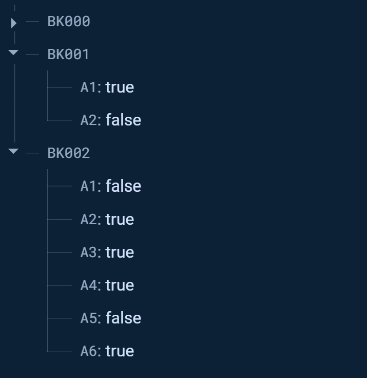

# Park_tracking_system
## Tables of Contents
1.[Introduction](#introduction)
2.[Hardware](#hardware)
3.[Firebase](#firebase)
4.[Principal concept of how webpage working](#principal-concept-of-how-webpage-working)
5.[Trivial](#trivial)

## Introduction
### This is my final high school project
This project starting from idea that today cars have been using widespreadly all around the world. While cars number are going higher, the spaces for parking is limited which lead to the problem that finding the parking take more time. So I decide to create this project to provide the parking status in that place which parking slot is avaliable so the users can plan their trip easily.

## Hardware
The IoT system I can't go deep down much but I'm gonna leave some reference to the main libs I've been using to communicate and transfer data into Firebase. There're a lot of another libs he has created and some of it might be useful for you as it's to me.
(seems like the libs I used it's deprecated so I leave the newer version for those who want to use it.)
**[FirebaseClient](https://github.com/mobizt/FirebaseClient)**

List about what you need in order to make the detection system.
***NOTE It's only to demonstrate the flows of collecting the data and send it to database.**
>* NodeMCU ESP8266
>* 2x hc-sr04 ultrasonic sensor (any others variants can be replace)

**For those who don't have the hardware you can just try test the functional by changing the value in the Firebase database.**
## Firebase
### Database
this is how the tree in my database look like. I use the Realtime-database and trying to keep it flat as possible so there're only two step here which the key in root are places and inside it's the parking slot in the place.

**I use Boolean since it's going to only display if the parking is avaliable or not.**


### Web Hosting
For those who have no idea how to host the website for your project I'd like to recommend firebase for beginner because it's so easy to use it and since if you're not considering to use it in production there's no need to worry about fees so if you want to try I'll put link below here.
>**[Firebase Get started with Hosting](https://firebase.google.com/docs/hosting/quickstart?hl=en&authuser=0)**
### Tips for Firebase Docs
For those who struggling with some examples in Docs. Well it's seem like some of those examples were deprecated so it might not function as it should so it take more time to scroll through some blog such as **Stack Overflow**.

***NOTE : it might be fix right now but I haven't check it yet since I've change to do C I got no bussiness with Firebase anymore.**

## Principal concept of how webpage working
Okay ,I'll keep it simple. I know the concept of how the web handle its data may trigger a lot of experienced devs so plz forgive me for this parts but I promise I'll improve myself.

Let's start with the get data section for this part it's something that over my skill for a bit but I try to figure it out for a while since Firebase Docs trick me for some parts ([From previous paragraph](#tips-for-firebase-docs)) so start from how Firebase organize their data it's kinda like the JSON which store in form of **key** and **Value**. In my database I name the root's key as a place I refer to and inside its has keys of each parking slot.

After we get all data we want we're going to render it by using **DOM** which I use as my workhorse to change from list of place into info about parking slot in the place by delete and create new child to put into table and store its data inside id and class. The reason I did this behavior is from my opinion is this web shouldn't reload itself every time we go back or forward so you can see in the example below that only thing that's changing is inside the table of container.


Also include with ```onChildChanged()``` function from firebase libs which make the web gonna update the attribute of the list that has been changed by access through the id.
## Trivial
This project has been validated since ```22 January 2024``` but I just commit into repo in ```21 June 2024```. So from now on the update afterward is my own intention to come back and improve my code in many aspect which it still can be improve for better.

Thanks for reading until here hope you enjoy my project see you again. The project afterward from now on is going to be in university but I might not have enough time to do things like this for a year since in the 1st year I'll enroll in the 42's so my direction would change to writting POSIX_C for a year to improve my skill further.